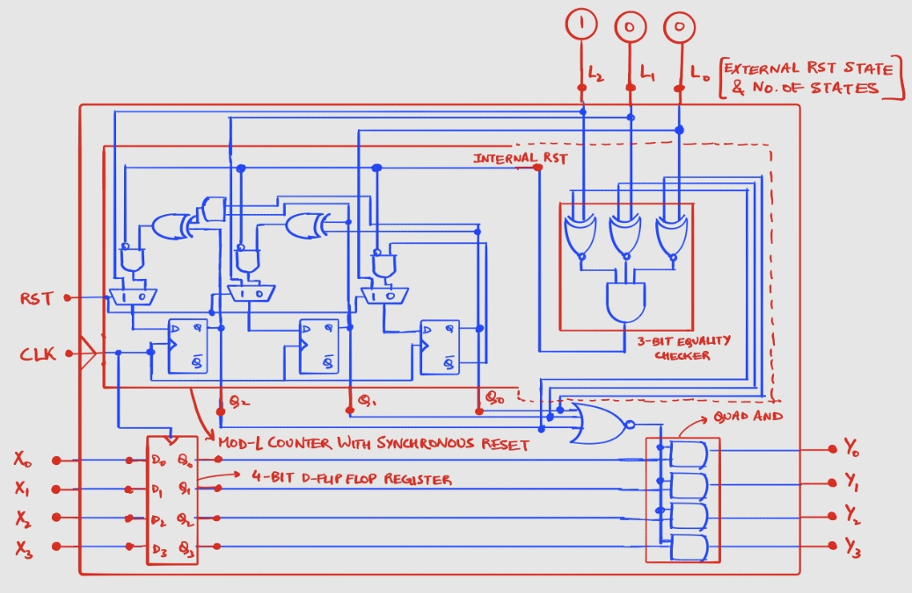
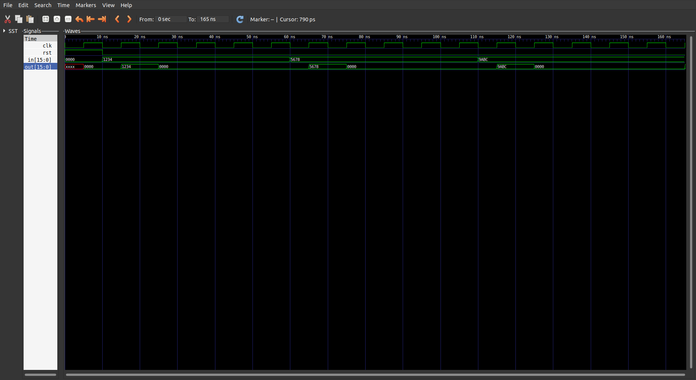

# Upsampler
## Overview
An L-fold upsampler, also known as an expander, is used in digital signal processing to widen "shrink" or "squeeze" the digital spectrum of a signal. This is achieved by placing L-1 zeros between every pair of consecutive samples of the signal. More formally,
```math
y_{L}[n] = 
\begin{cases}
x[n] & \text{if } n = pL \; \text{where} \; p \in \mathbb{Z^+}\\
0 & \text{otherwise}
\end{cases}
```

## Architecture
The upsampler can be thought of as an L-state finite state machine (FSM). The input to the FSM must remain fixed throughout each cycle of the FSM. The output of the FSM equals the input in **only one** state of the FSM, while the outputs of the remaining (L-1) states is 0. 

Consider: $N = \lceil{log_2(L)}\rceil$. Then an N-bit counter can be used to represent the FSM. Since it is possible for $L < 2^N$, an equality checker circuit can be used to compare the counter value with (L-1) and trigger the reset signal of the counter, with reset taking the counter value to 0. Although any arbitrary state can be chosen to be the state the passes the input to the output, I have chosen the zero state. To know if the counter is in the zero state, a simple $N$-input NOR gate would suffice, which can be AND-gated with the input bits to produce the output. 

The diagram given below shows the architecture for a 5-fold upsampler for 4-bit values, designed using the same ideas:




### \*Note:
1. The input format can be anything, i.e. a floating-point real value, a complex floating-point vector, fixed point representations, etc. 
2. After running preliminary simulations, I noticed that the input, when passed to the output, did not last for the same duration as that of the zero outputs. I had earlier directly passed the input to the quad AND gate, which caused timing errors as the input was not necessary synchronized to the counter. Hence, I utilized an M-bit register to buffer the input and synchronize the non-zero output with the counter states correctly. Another important point to note is that the input must remain constant for L clock cycles. Even if it doesn't, the sampled value at the zero state of the counter will be considered.
3. There exist an internal and an external reset mechanism. The internal reset mechanism ensures that the counter can take only values between $0$ and $L-1$. However, an external reset signal ($RST$) has been exposed, which bypasses the internal reset condition, which sets the counter value to 0, and instead sets it to $L_2L_1L_0$ (which represents $L-1$). Hence when $RST$ is asserted, the output always remains $0$. When the reset is lifted, at the immediate next triggering edge, the value of input $X$ gets buffered into the M-bit register and simultaneously appears at the output as the counter value gets reset to $0$ by the internal reset mechanism. Hence, there only exists at most a single cycle delay between the input signal and the downsampled output signal, which is an unavoidable consequence of buffering the input. Instead, if the external reset state were to be set to $0$, the previous value of the M-bit input buffer register would be outputted always, for how many ever cycles the input was asserted. This would mean that at the first instance, garbage values stored in the register at startup, would appear as the output, which is undesirable. It would also mean, that the valid input $X$ needs to be passed when $RST$ is asserted, which defeats the purpose of a clean reset.
   
## Simulation Results
This the GTKWave waveforms simulation for the latest commit of the testbench. The input/output word bus-width ($W$) is 16-bits, whereas the upsampling factor ($L$) is 5, matching that shown in the circuit, with the only difference being $W$.

The input $in[15:0]$ is toggled/changed at every non-triggering, negative edge of the clock, thus causing the initial delay of half a clock period ($5 \,n s$).
